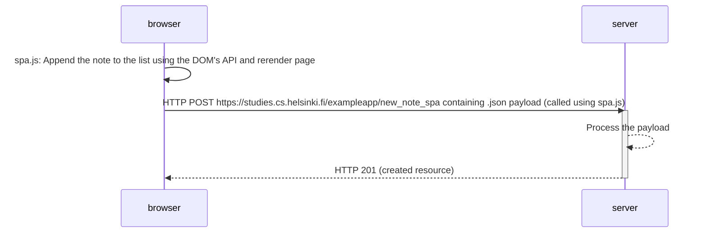

```mermaid
    sequenceDiagram
    participant browser
    participant server

    browser->>browser: spa.js: Append the note to the list using the DOM's API and rerender page

    browser->>server: HTTP POST https://studies.cs.helsinki.fi/exampleapp/new_note_spa containing .json payload (called using spa.js)
    activate server
    
    server-->>server: Process the payload 
    server-->>browser: HTTP 201 (created resource)
    deactivate server 
```